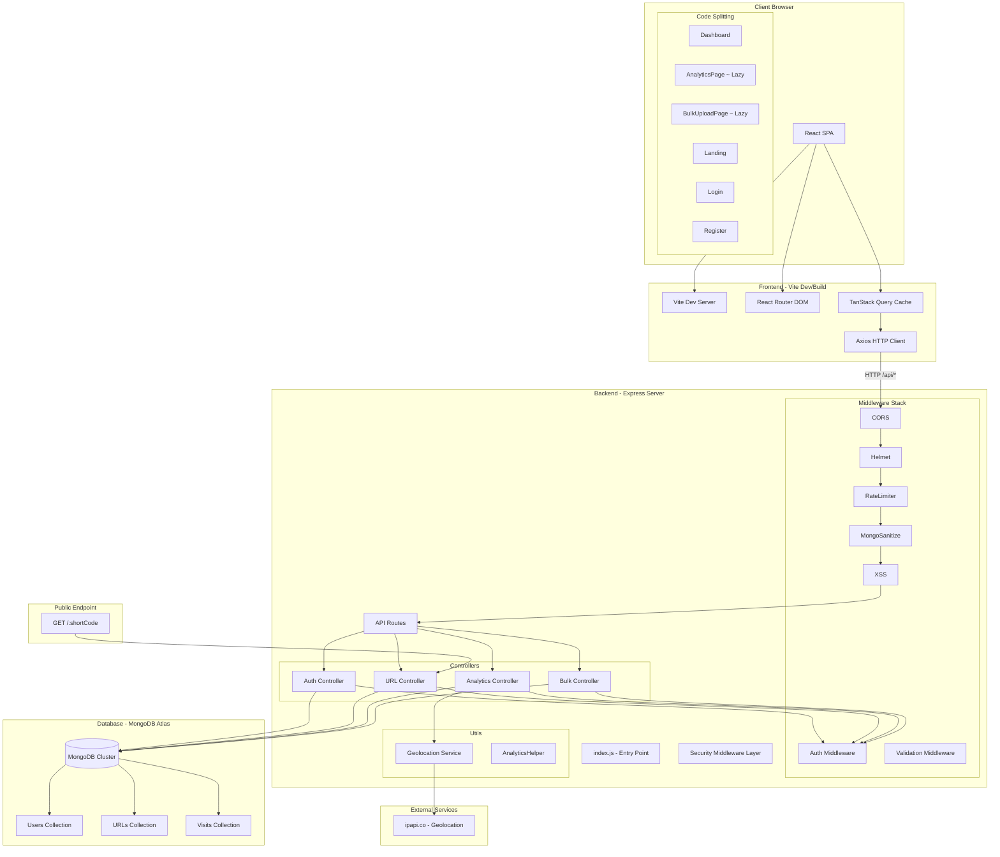

# LinkForge

**Forge Smarter Links. Track Every Click.**

A modern, production-ready URL shortening and analytics platform built with a full-stack JavaScript architecture. LinkForge provides enterprise-grade link management with real-time analytics, bulk operations, and a premium user experience.


---

## 📋 Table of Contents

- [Project Overview](#-project-overview)
- [Features](#-features)
- [Tech Stack](#️-tech-stack)
- [Architecture Diagram](#️-architecture-diagram)
- [Setup Instructions](#-setup-instructions)
- [Environment Variables](#-environment-variables)
- [API Overview](#-api-overview)
- [Deployment Instructions](#-deployment-instructions)
- [Assumptions Made](#-assumptions-made)
- [Screenshots](#-screenshots)
- [Demo Video](#-demo-video)
- [Future Improvements](#-future-improvements)
- [Security Considerations](#-security-considerations)

---

## 📖 Project Overview

LinkForge is a full-featured URL shortener that goes beyond simple redirection. It offers:

- **Smart URL Shortening** with auto-generated or custom short codes
- **Comprehensive Analytics** including click trends, device breakdowns, geolocation, and referrer tracking
- **Bulk Operations** with CSV upload to create hundreds of links at once
- **Password Protection** for sensitive links
- **QR Code Generation** for every shortened URL
- **Time-bound Links** with start and expiry dates

The application is split into two independent deployable units:
- **Backend**: Node.js/Express REST API with MongoDB persistence
- **Frontend**: React SPA built with Vite, consuming the backend API

---

## 🚀 Features

### Authentication
- **User Registration** with email validation and strong password requirements
- **Secure Login** with JWT token-based authentication (30-day expiry)
- **Protected Routes** for dashboard, analytics, and settings
- **Profile Management** with password change functionality
- **Account Deletion** with confirmation

### URL Shortening
- **Smart URL Shortening** with auto-generated 8-character short codes (nanoid)
- **Custom Aliases** for branded, human-readable links
- **Expiry Dates** for time-limited links
- **Start Dates** for scheduled link activation
- **Password Protection** with bcrypt-hashed passwords
- **QR Code Generation** for every URL
- **Bulk Upload** via CSV for creating multiple links at once
- **Link Management** full CRUD with edit, delete, and status tracking

### Analytics & Tracking
- **Real-time Click Tracking** with per-visit detail capture
- **Device Analytics** browser, device type, operating system classification
- **Geolocation Tracking** country and city via ipapi.co
- **Referrer Tracking** source attribution for every click
- **Click Trends** daily, weekly, and monthly aggregation with chart visualization
- **Workspace Analytics** aggregate stats across all user links
- **Country Breakdown** map-based click distribution
- **Activity Timeline** chronological visit feed

### Security
- **JWT Authentication** with 30-day token and Bearer header validation
- **Password Hashing** with bcrypt (10 salt rounds)
- **Helmet** HTTP header security middleware
- **Rate Limiting** global (100 req/15min), auth (5 req/15min), URL creation (50 req/hr)
- **CORS** strict origin validation in production, relaxed for localhost in development
- **Input Sanitization** express-mongo-sanitize for NoSQL injection prevention
- **XSS Protection** xss-clean middleware
- **Environment Validation** production startup fails fast if required env vars missing

### UI/UX
- **Premium SaaS Design** inspired by Linear, Stripe, and Vercel
- **Glassmorphism Effects** for modern aesthetic
- **Smooth Animations** with Framer Motion page transitions
- **Responsive Design** mobile-first approach
- **Dark/Light Mode** with theme persistence
- **Code Splitting** lazy-loaded analytics and bulk-upload pages for fast initial load
- **Animated Components** counters, cards, and progress indicators

---

## 🛠️ Tech Stack

### Frontend
| Technology | Purpose |
|------------|---------|
| **React 18** | UI component library |
| **Vite** | Build tool and development server |
| **React Router DOM v6** | Client-side routing |
| **Axios** | HTTP client with interceptors |
| **TanStack React Query** | Server state management, caching, and mutations |
| **Tailwind CSS** | Utility-first styling |
| **Recharts** | Data visualization (line charts, pie charts) |
| **Framer Motion** | Animation library |
| **Lucide Icons** | Icon set |
| **Sonner** | Toast notification system |
| **qrcode** | Client-side QR code generation |

### Backend
| Technology | Purpose |
|------------|---------|
| **Node.js** | JavaScript runtime |
| **Express.js** | Web application framework |
| **MongoDB** | NoSQL document database |
| **Mongoose** | Object Data Modeling (ODM) |
| **jsonwebtoken** | JWT creation and verification |
| **bcryptjs** | Password hashing |
| **nanoid** | Short code generation |
| **helmet** | HTTP security headers |
| **express-rate-limit** | Rate limiting middleware |
| **cors** | Cross-Origin Resource Sharing |
| **express-mongo-sanitize** | NoSQL injection prevention |
| **xss-clean** | XSS attack prevention |
| **ua-parser-js** | User agent parsing |
| **csv-parser / csv-writer** | CSV parsing and generation |
| **axios** | HTTP client for geolocation service |
| **dotenv** | Environment variable loading |

### Infrastructure
| Service | Purpose |
|---------|---------|
| **MongoDB Atlas** | Managed cloud database |
| **Render** | Backend hosting |
| **Vercel** | Frontend hosting |

---

## 🏗️ Architecture Diagram



### Data Flow

1. **User creates a short link**: Frontend → POST /api/urls → JWT Auth → URL Controller → Validate → Store in MongoDB → Return short URL
2. **Visitor clicks a short link**: Browser → GET /:shortCode → URL Controller → Lookup → Capture visit data (UA, IP, referrer) → Enrich with geolocation → Store Visit → HTTP 302 redirect
3. **User views analytics**: Frontend → GET /api/analytics/:id → JWT Auth → Analytics Controller → Aggregate visits → Return trends, breakdowns, timeline

---

## 📦 Setup Instructions

### Prerequisites

- **Node.js** v18 or higher
- **MongoDB Atlas** account or local MongoDB instance (v6+)
- **npm** (comes with Node.js) or **yarn**

### MongoDB Atlas Setup

1. **Create a MongoDB Atlas Account**
   - Go to [MongoDB Atlas](https://www.mongodb.com/cloud/atlas)
   - Sign up for a free account (M0 sandbox cluster is sufficient for development)
   - Create a new cluster
   - Create a database user with username and password
   - Whitelist your IP address (use `0.0.0.0/0` for development convenience)

2. **Get Connection String**
   - Click "Connect" on your cluster
   - Choose "Connect your application"
   - Copy the connection string (e.g., `mongodb+srv://<user>:<password>@cluster0.xxxxx.mongodb.net/linkforge?retryWrites=true&w=majority`)
   - Replace `<password>` with your database user password

### Installation

1. **Clone the repository**
   ```bash
   git clone https://github.com/yourusername/LinkForge.git
   cd LinkForge
   ```

2. **Install Backend Dependencies**
   ```bash
   cd backend
   npm install
   ```

3. **Install Frontend Dependencies**
   ```bash
   cd ../frontend
   npm install
   ```

### Configure Environment

4. **Create Backend Environment**
   ```bash
   cd ../backend
   ```
   Create `backend/.env` with:
   ```env
   PORT=5000
   MONGO_URI=mongodb+srv://<username>:<password>@cluster0.mongodb.net/linkforge?retryWrites=true&w=majority
   JWT_SECRET=your-64-char-hex-secret
   FRONTEND_URL=http://localhost:5173
   BACKEND_URL=http://localhost:5000
   GEOLOCATION_API_KEY=
   NODE_ENV=development
   ```

5. **Create Frontend Environment**
   ```bash
   cd ../frontend
   ```
   Create `frontend/.env` with:
   ```env
   VITE_API_URL=http://localhost:5000
   ```

### Running the Application

6. **Start the Backend Server** (terminal 1)
   ```bash
   cd backend
   npm run dev
   ```
   Backend runs on `http://localhost:5000`

7. **Start the Frontend Dev Server** (terminal 2)
   ```bash
   cd frontend
   npm run dev
   ```
   Frontend runs on `http://localhost:5173`

8. **Open the Application**
   - Navigate to `http://localhost:5173`
   - Register a new account
   - Start forging links!

---

## 🔐 Environment Variables

### Backend (`backend/.env`)

| Variable | Required | Default | Purpose |
|----------|----------|---------|---------|
| `PORT` | No | `5000` | Express server listen port |
| `NODE_ENV` | Recommended | — | Runtime mode (`development`/`production`). Controls CORS strictness and auth rate-limits |
| `MONGO_URI` | Yes (or `MONGODB_URI`) | — | Primary MongoDB connection string |
| `MONGODB_URI` | No (fallback) | — | Alternative MongoDB URI if `MONGO_URI` is unset |
| `JWT_SECRET` | Yes | — | HMAC key for JWT signing/verification. Generate with `node -e "console.log(require('crypto').randomBytes(64).toString('hex'))"` |
| `FRONTEND_URL` | Yes | — | CORS allowed origin, redirect links, password-verify redirect target |
| `BACKEND_URL` | Yes | — | Base URL for constructing short links (e.g., `https://api.linkforge.example.com` or `http://localhost:5000`) |
| `GEOLOCATION_API_KEY` | No | — | ipapi.co API key for geolocation enrichment. Falls back to `'Unknown'` if empty |

> **Production safety**: The backend validates that `MONGO_URI`, `JWT_SECRET`, `FRONTEND_URL`, and `BACKEND_URL` are set at startup. In production mode, the server exits with an error if any are missing.

### Frontend (`frontend/.env` or `frontend/.env.production`)

| Variable | Required | Default | Purpose |
|----------|----------|---------|---------|
| `VITE_API_URL` | Yes (production) | `http://localhost:5000` | Backend API base URL. In production builds, **must** be set — the build will throw an error if missing |

> **Note**: `VITE_API_URL` uses Vite's `import.meta.env` system. It is replaced at **build time**, not runtime.

---

## 📡 API Overview

### Authentication Endpoints

| Method | Path | Auth | Description |
|--------|------|------|-------------|
| `POST` | `/api/auth/register` | No | Register a new user |
| `POST` | `/api/auth/login` | No | Login and receive JWT |
| `GET` | `/api/auth/profile` | Bearer | Get current user profile |
| `PUT` | `/api/auth/change-password` | Bearer | Change account password |
| `DELETE` | `/api/auth/delete-account` | Bearer | Delete account permanently |

### URL Endpoints

| Method | Path | Auth | Description |
|--------|------|------|-------------|
| `POST` | `/api/urls` | Bearer | Create a short URL |
| `GET` | `/api/urls` | Bearer | List all user URLs |
| `GET` | `/api/urls/:id` | Bearer | Get URL by ID |
| `PUT` | `/api/urls/:id` | Bearer | Update a URL |
| `DELETE` | `/api/urls/:id` | Bearer | Delete a URL |

### Analytics Endpoints

| Method | Path | Auth | Description |
|--------|------|------|-------------|
| `GET` | `/api/analytics/:id` | Bearer | Get analytics for a URL |
| `GET` | `/api/analytics/:id/visits` | Bearer | Get visit records |
| `GET` | `/api/analytics/:id/trends` | Bearer | Get click trends (daily/weekly/monthly) |
| `GET` | `/api/analytics/:id/countries` | Bearer | Get country breakdown |
| `GET` | `/api/analytics/:id/referrers` | Bearer | Get referrer breakdown |
| `GET` | `/api/analytics/workspace` | Bearer | Aggregate workspace analytics |
| `GET` | `/api/analytics/workspace/trends` | Bearer | Workspace-level click trends |
| `GET` | `/api/analytics/workspace/countries` | Bearer | Workspace-level country breakdown |
| `GET` | `/api/analytics/workspace/referrers` | Bearer | Workspace-level referrer breakdown |

### Bulk Endpoints

| Method | Path | Auth | Description |
|--------|------|------|-------------|
| `POST` | `/api/bulk/upload` | Bearer | Bulk create URLs from array |

### Public Endpoints

| Method | Path | Auth | Description |
|--------|------|------|-------------|
| `GET` | `/:shortCode` | No | Redirect to original URL |
| `GET` | `/stats/:shortCode` | No | Get public stats for a short code |

### Common Response Format

```json
{
  "success": true,
  "message": "Operation completed",
  "data": {}
}
```

Error responses:
```json
{
  "success": false,
  "message": "Human-readable error description"
}
```

---

## 🚀 Deployment Instructions

### Backend Deployment (Render)

1. **Prepare the backend**
   - The backend root directory is `backend/`
   - Ensure `backend/.gitignore` includes `.env` and `node_modules`

2. **Create a Render Web Service**
   - Log in to [Render Dashboard](https://dashboard.render.com)
   - Click **New +** → **Web Service**
   - Connect your GitHub repository
   - Configure:

   | Setting | Value |
   |---------|-------|
   | **Name** | `linkforge-api` |
   | **Root Directory** | `backend` |
   | **Build Command** | `npm install` |
   | **Start Command** | `node src/index.js` |
   | **Plan** | Free (or Starter for production) |

3. **Add Environment Variables in Render Dashboard**

   | Variable | Production Value |
   |----------|-----------------|
   | `NODE_ENV` | `production` |
   | `MONGO_URI` | `mongodb+srv://<user>:<pass>@prod-cluster.mongodb.net/linkforge?retryWrites=true&w=majority` |
   | `JWT_SECRET` | `<64-byte-hex-from-crypto.randomBytes(64)>` |
   | `FRONTEND_URL` | `https://linkforge.vercel.app` (your Vercel domain) |
   | `BACKEND_URL` | `https://linkforge-api.onrender.com` (your Render domain) |
   | `GEOLOCATION_API_KEY` | (optional) from ipapi.co |

4. **Deploy**
   - Click **Create Web Service**
   - Render will build and deploy automatically

### Frontend Deployment (Vercel)

1. **Prepare the frontend**
   - The frontend root directory is `frontend/`
   - Create `frontend/.env.production` with `VITE_API_URL=https://linkforge-api.onrender.com`

2. **Create a Vercel Project**
   - Log in to [Vercel Dashboard](https://vercel.com)
   - Click **Add New** → **Project**
   - Import your GitHub repository
   - Configure:

   | Setting | Value |
   |---------|-------|
   | **Framework Preset** | `Vite` |
   | **Root Directory** | `frontend` |
   | **Build Command** | `npm run build` |
   | **Output Directory** | `dist` |

3. **Add Environment Variable in Vercel Dashboard**
   - Under **Environment Variables**, add:
   - `VITE_API_URL` = `https://linkforge-api.onrender.com`
   - Apply to **Production** environment

4. **Deploy**
   - Click **Deploy**
   - Vercel will build and deploy, outputting a production URL

---

## 🤔 Assumptions Made

1. **MongoDB Atlas as primary database**: The application assumes a MongoDB connection via a connection string URI. No support for SQL databases.

2. **JWT-based authentication**: The auth system assumes a stateless token-based approach with 30-day token expiry, stored client-side in localStorage.

3. **ipapi.co for geolocation**: The free tier is used for development. In production, a paid API key or alternative service may be needed for higher volume.

4. **Single-user analytics scope**: Analytics are scoped to individual users. Team/workspace multi-user access is not implemented.

5. **CSV-only bulk upload**: Bulk operations accept only CSV files via manual file upload or JSON array in the API. No direct Google Sheets or cloud storage integration.

6. **Client-side QR generation**: QR codes are generated entirely in the browser using the `qrcode` npm package. No server-side QR generation.

7. **Render for backend, Vercel for frontend**: This deployment combo assumes the user has accounts with both services. Alternative platforms (AWS, GCP, DigitalOcean) are possible but not documented.

8. **No automated test suite**: The project currently relies on manual testing. Automated tests (unit, integration, E2E) are listed as a future improvement.

---

## 📸 Screenshots

### Landing Page


*Hero section with call-to-action and feature highlights.*

### Dashboard


*Main dashboard showing all created links with click counts, short codes, and management actions.*

### Analytics


*Comprehensive analytics view with hero metrics, click trend line chart, device/browser pie charts, country breakdown, and activity timeline.*

### Bulk Upload


*CSV upload interface with validation summary, URL preview table, and results export.*

### Settings


*User settings page with password change and account management.*

---

## 🎥 Demo Video

[[LinkForge Demo Video]](https://placeholder.link/video-url)

*A walkthrough covering: registration, creating a short link, custom aliases, password protection, viewing analytics, bulk CSV upload, and mobile responsiveness.*

---

## 🔮 Future Improvements

- [ ] **Team & Workspaces**: Multi-user collaboration with role-based access control (RBAC)
- [ ] **Link Organization**: Folders, tags, and advanced search/filtering
- [ ] **Custom Domains**: Allow users to use their own domain for branded short links
- [ ] **Expiration Notifications**: Email/webhook notifications when links are about to expire
- [ ] **A/B Testing**: Create multiple destinations for the same short code and track conversion
- [ ] **Public API Key System**: Allow third-party integrations via scoped API keys
- [ ] **Real-time Analytics**: WebSocket-based live click feed
- [ ] **Link Archiving**: Soft-delete with restore and purging policies
- [ ] **Link Scheduling**: Set precise activation/deactivation times
- [ ] **Social Media Integration**: Auto-post shortened links to social platforms
- [ ] **Link Preview Generation**: Open Graph metadata generation for shared links
- [ ] **PDF/CSV Export**: Advanced report exports for analytics data
- [ ] **Mobile App**: React Native companion app
- [ ] **Automated Testing**: Unit tests (Jest), integration tests (Supertest), E2E tests (Playwright)
- [ ] **CI/CD Pipeline**: GitHub Actions for automated testing, linting, and deployment
- [ ] **Monitoring & Alerting**: Sentry for error tracking, Datadog/Grafana for performance

---

## 🔒 Security Considerations

- **Never commit `.env` files** — both `backend/.gitignore` and `frontend/.gitignore` exclude `.env`
- **Use strong JWT secrets** — generate with `crypto.randomBytes(64).toString('hex')`
- **Enable HTTPS** in production (handled automatically by Render and Vercel)
- **Rate limiting** protects auth and URL creation endpoints from brute force
- **Input sanitization** prevents NoSQL injection and XSS attacks
- **CORS is strict** in production — only the configured `FRONTEND_URL` origin is allowed
- **Dependencies** should be regularly updated with `npm audit fix`
- **Logging** — backend logs include masked MongoDB URIs; no secrets logged

---

## 👥 Team

- **Your Name** — Full Stack Developer

## 🙏 Acknowledgments

- Inspired by bit.ly, TinyURL, and Rebrandly
- UI design inspired by Linear (project management), Stripe (payments), and Vercel (deployment)
- Built with modern web technologies during the Katomaran Hackathon

This project is a part of a hackathon run by https://katomaran.com