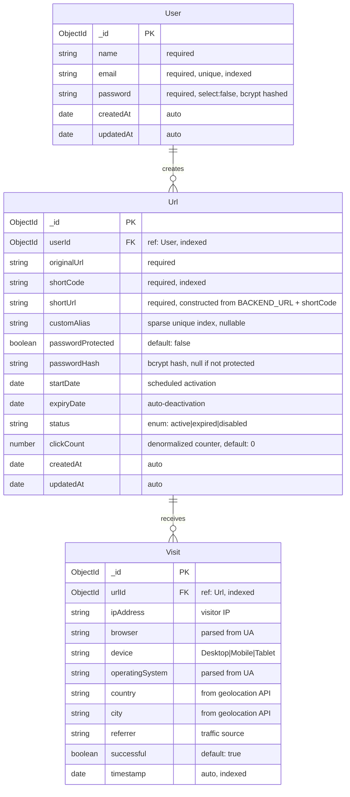
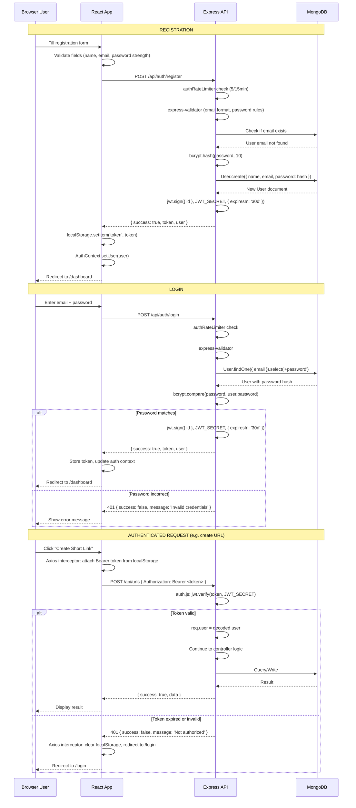
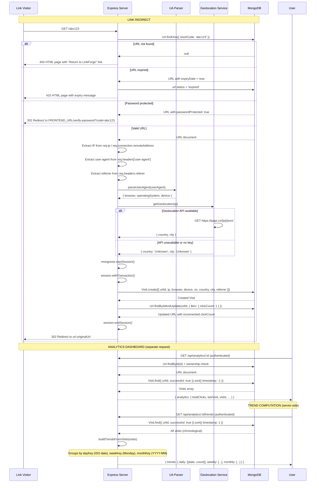
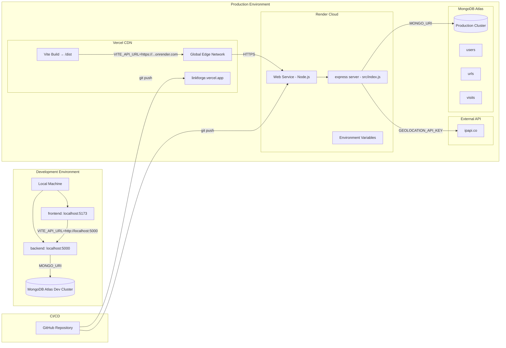

# ARCHITECTURE.md

## LinkForge System Architecture

---

## 1. System Architecture Overview

```mermaid
graph TB
    %% ========== External Users ==========
    subgraph "External Actors"
        User[End User / Browser]
        Visitor[Link Visitor]
    end

    %% ========== Frontend (Vercel) ==========
    subgraph "Frontend Layer — Vercel CDN"
        direction TB
        DNS[linkforge.vercel.app]
        Vite[Vite Build Output]
        SPA[React SPA - /dist]
        
        subgraph "React Application"
            Router[React Router v6]
            Query[TanStack Query Cache]
            Axios[Axios HTTP Client]
            UI_Components[UI Components]
            
            subgraph "Pages"
                Landing
                Login
                Register
                Dashboard
                AnalyticsPage
                BulkUpload
                Settings
            end

            subgraph "Contexts"
                AuthCtx[Auth Context]
                ThemeCtx[Theme Context]
            end

            subgraph "Hooks"
                useUrls
                useAnalytics
            end
        end
    end

    %% ========== Backend (Render) ==========
    subgraph "Backend Layer — Render Cloud"
        direction TB
        API_Gateway[linkforge-api.onrender.com]
        
        subgraph "Express Server (index.js)"
            ENV_Validation[Startup: env validation]
            
            subgraph "Middleware Pipeline (order matters)"
                Helmet[helmet - security headers]
                CORS[cors - origin check]
                RateLimiterGlobal[rate-limit - 100/15min]
                MongoSanitize[mongo-sanitize - NoSQL injection]
                XSS[xss-clean]
            end

            subgraph "Routes"
                AuthRoutes[/api/auth/*]
                UrlRoutes[/api/urls/*]
                AnalyticsRoutes[/api/analytics/*]
                BulkRoutes[/api/bulk/*]
                PublicRoutes[/:shortCode, /stats/:shortCode]
            end

            subgraph "Controllers"
                AuthCtrl[authController]
                UrlCtrl[urlController]
                AnalyticsCtrl[analyticsController]
                BulkCtrl[bulkController]
            end

            subgraph "Middlewares (per-route)"
                AuthMid[auth - JWT verify]
                ValidationMid[validation - express-validator]
                RateLimiterAuth[authRateLimiter - 5/15min]
                RateLimiterUrl[urlRateLimiter - 50/hr]
            end

            subgraph "Utilities"
                GeoService[geolocation.js - ipapi.co]
                AnalyticsHelper[analyticsHelper.js - UA parsing]
            end
        end
    end

    %% ========== Database ==========
    subgraph "Data Layer — MongoDB Atlas"
        direction TB
        Cluster[(MongoDB Cluster)]
        Users[users collection]
        Urls[urls collection]
        Visits[visits collection]
    end

    %% ========== External Services ==========
    subgraph "External Services"
        ipapi[ipapi.co - Geolocation API]
    end

    %% ========== Connections ==========
    User -->|"HTTPS"| DNS
    Visitor -->|"GET /abc123"| API_Gateway
    
    DNS --> SPA
    
    SPA --> Router
    Router --> Landing
    Router --> Login
    Router --> Register
    Router --> Dashboard
    Router --> AnalyticsPage
    Router --> BulkUpload
    Router --> Settings

    Login --> AuthCtx
    AuthCtx --> Axios
    Axios -->|"HTTP Bearer Token"| API_Gateway

    useUrls --> Query
    useAnalytics --> Query
    Query --> Axios

    API_Gateway -->|"Request flows through pipeline"| Helmet
    Helmet --> CORS
    CORS --> RateLimiterGlobal
    RateLimiterGlobal --> MongoSanitize
    MongoSanitize --> XSS
    XSS --> AuthRoutes
    XSS --> UrlRoutes
    XSS --> AnalyticsRoutes
    XSS --> BulkRoutes
    XSS --> PublicRoutes

    AuthRoutes --> RateLimiterAuth
    RateLimiterAuth --> ValidationMid
    ValidationMid --> AuthCtrl

    UrlRoutes --> AuthMid
    AuthMid --> RateLimiterUrl
    RateLimiterUrl --> UrlCtrl

    AnalyticsRoutes --> AuthMid
    AuthMid --> AnalyticsCtrl

    BulkRoutes --> AuthMid
    AuthMid --> BulkCtrl

    PublicRoutes --> UrlCtrl

    AuthCtrl --> Users
    UrlCtrl --> Urls
    AnalyticsCtrl --> Visits
    BulkCtrl --> Urls

    UrlCtrl --> AnalyticsHelper
    AnalyticsHelper -->|"user-agent parsing"| GeoService
    GeoService -->|"IP geolocation"| ipapi

    Urls -->|"hasMany"| Visits
    Users -->|"hasMany"| Urls

    %% ========== Key Metrics ==========
    subgraph "Key Metrics"
        M1["Frontend Bundle: ~350 KB (after code split)"]
        M2["Backend: Node.js + Express"]
        M3["Database: MongoDB Atlas M0 (free tier)"]
        M4["Auth: JWT 30-day expiry"]
        M5["Rate Limits: Auth 5/15min, Global 100/15min, URL 50/hr"]
    end
```

### Request Flow Summary

1. **Browser → Vercel CDN**: User visits `linkforge.vercel.app`, Vite-built SPA is served
2. **Frontend → Backend API**: React makes authenticated API calls via Axios to `api.linkforge.onrender.com`
3. **Middleware Pipeline**: Every request passes through Helmet → CORS → Rate Limiter → Mongo Sanitize → XSS Clean
4. **Route Handler**: Request reaches the appropriate controller after JWT verification (for protected routes)
5. **Database**: Controller queries MongoDB via Mongoose ODM
6. **External Services**: Analytics controllers enrich visit data with geolocation from ipapi.co
7. **Response**: JSON response flows back through the chain to the frontend

---

## 2. Frontend Architecture

### Component Hierarchy

```
App.jsx (root)
├── QueryClientProvider (TanStack Query)
│   └── ThemeProvider (context)
│       └── BrowserRouter
│           └── AuthProvider (context)
│               └── Toaster (Sonner)
│                   └── Suspense (loading fallback)
│                       └── AnimatePresence (Framer Motion)
│                           └── Routes
│                               ├── LandingPage (public)
│                               ├── LoginPage (public)
│                               ├── RegisterPage (public)
│                               ├── VerifyPasswordPage (public)
│                               └── MainLayout (protected, with sidebar)
│                                   ├── DashboardPage
│                                   ├── AnalyticsPage (LAZY)
│                                   ├── SettingsPage
│                                   └── BulkUploadPage (LAZY)
```

### Code Splitting Strategy

| Page | Load Strategy | Bundle Size Impact |
|------|--------------|-------------------|
| LandingPage | Eager (critical path) | Lightweight |
| LoginPage | Eager | Lightweight |
| RegisterPage | Eager | Lightweight |
| DashboardPage | Eager | Moderate (link list) |
| **AnalyticsPage** | **Lazy** (`React.lazy`) | **~350 KB deferred** (recharts, pie/line charts) |
| **BulkUploadPage** | **Lazy** (`React.lazy`) | **~100 KB deferred** (CSV parsing) |
| SettingsPage | Eager | Lightweight |
| QRCodeGenerator | Component-level lazy (rendered only on modal open) | ~286 KB on-demand |

### Data Flow Architecture

```
User Interaction
      ↓
React Component (page)
      ↓
Custom Hook (useUrls, useAnalytics)
      ↓
TanStack Query (cache layer, retries, stale time)
      ↓
Axios Instance (api.js)
      ↓
  ├── Request Interceptor (attaches JWT Bearer token)
  ├── HTTP Request to Backend API
  └── Response Interceptor (401 → redirect to /login)
```

### State Management

| State Type | Mechanism | Example |
|-----------|-----------|---------|
| Server State | TanStack Query cache | URLs list, analytics data |
| Auth State | React Context (AuthProvider) | Current user, token |
| Theme State | React Context (ThemeProvider) | Dark/light mode |
| UI State | Component-local useState | Modal open/close, form inputs |
| URL State | React Router searchParams | `?urlId=` for analytics selection |

---

## 3. Backend Architecture

### Project Structure

```
backend/
├── config/
│   └── database.js          # MongoDB connection with error handling
├── src/
│   ├── index.js             # Entry point: middleware stack, routes, server start
│   ├── controllers/
│   │   ├── authController.js     # register, login, profile, changePassword, deleteAccount
│   │   ├── urlController.js      # CRUD + redirect + password verify + public stats
│   │   ├── analyticsController.js # Analytics + trends + breakdowns (per-link + workspace)
│   │   └── bulkController.js     # Bulk URL creation from JSON array
│   ├── middlewares/
│   │   ├── auth.js          # JWT verification middleware
│   │   ├── error.js         # 404 handler + global error handler
│   │   ├── security.js      # Rate limiters (global, auth, URL creation)
│   │   └── validation.js    # express-validator rules for register/login/password
│   ├── models/
│   │   ├── User.js          # name, email, password (select:false), timestamps
│   │   ├── Url.js           # originalUrl, shortCode, customAlias, expiry, password, clickCount
│   │   └── Visit.js         # urlId, IP, browser, device, OS, country, city, referrer, timestamp
│   ├── routes/
│   │   ├── authRoutes.js
│   │   ├── urlRoutes.js
│   │   ├── analyticsRoutes.js
│   │   └── bulkRoutes.js
│   └── utils/
│       ├── analyticsHelper.js   # UA parsing + geolocation enrichment
│       └── geolocation.js       # ipapi.co client with fallback
├── .env                     # Environment variables (gitignored)
├── package.json
└── .gitignore
```

### Middleware Pipeline (Execution Order)

```
Incoming Request
    ↓
 1. helmet()           — Sets 15+ security headers (CSP, HSTS, X-Frame-Options, etc.)
    ↓
 2. cors()             — Validates Origin against FRONTEND_URL (strict in prod)
    ↓
 3. express.json()     — Parses JSON request bodies
    ↓
 4. express.urlencoded() — Parses URL-encoded bodies
    ↓
 5. rateLimiter        — Global: 100 requests per 15-minute window
    ↓
 6. mongoSanitize()    — Strips $ and . from keys to prevent NoSQL injection
    ↓
 7. xss()              — Sanitizes input to prevent cross-site scripting
    ↓
 8. Route Matching     — /api/auth/*, /api/urls/*, /api/analytics/*, /api/bulk/*
    ↓
 9. (if protected) JWT Auth Middleware — Verifies Bearer token, attaches req.user
    ↓
10. (if applicable) Route-specific Rate Limiter — Auth: 5/15min, URL: 50/hr
    ↓
11. (if applicable) Validation Middleware — express-validator checks
    ↓
12. Controller Logic   — Business logic, database queries
    ↓
13. Response           — JSON or HTML redirect
```

### Environment Validation (Startup)

```javascript
// Added during production hardening — runs at server start
const REQUIRED_ENV_VARS = ['MONGO_URI', 'JWT_SECRET', 'FRONTEND_URL', 'BACKEND_URL'];
// If MONGO_URI is missing but MONGODB_URI is present, that's acceptable
// In production: exits process with code 1 if any required vars are missing
// In development: logs a warning but continues
```

---

## 4. Database Architecture

### Entity-Relationship Diagram



### Index Strategy

| Collection | Index | Type | Purpose |
|-----------|-------|------|---------|
| `users` | `email` | Unique | Prevent duplicate registrations, fast login lookup |
| `urls` | `shortCode` | Regular | Fast redirect lookup by short code |
| `urls` | `userId` | Regular | List all URLs for a user |
| `urls` | `customAlias` | Sparse Unique | Unique custom aliases, allows null values |
| `visits` | `urlId` | Regular | All analytics queries filter by URL |
| `visits` | `timestamp` | Regular | Trend aggregation date-range queries |
| `visits` | `urlId + successful` | Compound (implicit) | Filtering analytics for successful visits only |

### Schema Design Rationale

**Why separate visits collection instead of embedded?**
A single URL can accumulate millions of clicks over time. Embedding visits inside the URL document would exceed MongoDB's 16 MB document size limit. The separate collection with an index on `urlId` provides efficient querying without size constraints.

**Why denormalized `clickCount` on URLs?**
Calculating `clickCount` by counting visits on every dashboard load would be expensive. Instead, `clickCount` is incremented atomically with `$inc` during redirect, providing instant display without aggregation queries.

**Why `select: false` on password?**
Prevents accidental exposure of password hashes in query results. The field must be explicitly included with `.select('+password')` when needed (login comparison, password change).

---

## 5. Authentication Flow



### Token Storage Strategy

- **Storage**: `localStorage` (chosen over cookies for simplicity with separate frontend/backend domains)
- **Expiry**: 30 days (configurable in `authController.js` via `expiresIn: '30d'`)
- **Token in requests**: Axios request interceptor reads from `localStorage` and sets `Authorization: Bearer <token>` header
- **Token validation**: Backend `auth.js` middleware verifies on every protected route
- **401 Handling**: Axios response interceptor detects 401, clears storage, redirects to login

---

## 6. Analytics Flow



### Analytics Data Capture

Every click on a short URL captures the following data:

| Field | Source | Example |
|-------|--------|---------|
| `ipAddress` | `req.ip` | `192.168.1.1` |
| `browser` | User-agent parsing | `Chrome`, `Firefox`, `Safari` |
| `device` | User-agent parsing | `Desktop`, `Mobile`, `Tablet` |
| `operatingSystem` | User-agent parsing | `Windows 10`, `iOS 17`, `Android 14` |
| `country` | ipapi.co geolocation | `United States`, `India` |
| `city` | ipapi.co geolocation | `New York`, `Mumbai` |
| `referrer` | `req.headers.referer` | `https://twitter.com/post/123`, `Direct` |
| `timestamp` | Auto-generated | `2024-03-15T10:30:00.000Z` |

### Trend Computation Logic

```javascript
// Server-side aggregation (analyticsController.js)
const buildTrendsFromVisits = (visits) => {
  visits.forEach((visit) => {
    const date = new Date(visit.timestamp);
    const dayKey = date.toISOString().split('T')[0];           // "2024-03-15"
    const weekKey = getWeekKey(date);                           // Monday's date
    const monthKey = date.toISOString().slice(0, 7);            // "2024-03"

    dailyTrends[dayKey] = (dailyTrends[dayKey] || 0) + 1;
    weeklyTrends[weekKey] = (weeklyTrends[weekKey] || 0) + 1;
    monthlyTrends[monthKey] = (monthlyTrends[monthKey] || 0) + 1;
  });

  return {
    daily: formatTrends(dailyTrends),   // sorted by date
    weekly: formatTrends(weeklyTrends), // sorted by week
    monthly: formatTrends(monthlyTrends) // sorted by month
  };
};
```

---

## 7. Deployment Architecture



### Deployment Configuration Summary

#### Backend (Render)

| Configuration | Value |
|---------------|-------|
| **Runtime** | Node.js 18+ |
| **Build Command** | `npm install` |
| **Start Command** | `node src/index.js` |
| **Root Directory** | `backend/` |
| **Plan** | Free tier (spins down after inactivity) / Starter for production |

**Required Environment Variables:**
- `NODE_ENV=production`
- `MONGO_URI` — MongoDB Atlas connection string
- `JWT_SECRET` — 64-byte hex string
- `FRONTEND_URL` — Vercel deployment URL
- `BACKEND_URL` — Render service URL
- `GEOLOCATION_API_KEY` — (optional)

#### Frontend (Vercel)

| Configuration | Value |
|---------------|-------|
| **Framework Preset** | Vite |
| **Build Command** | `npm run build` |
| **Output Directory** | `dist` |
| **Root Directory** | `frontend/` |
| **Node Version** | 18.x (Vercel default) |

**Required Environment Variables:**
- `VITE_API_URL` — Render backend URL (set in Vercel dashboard)

### DNS Architecture

```
User → https://linkforge.example.com (Vercel)
                     ↓
         Vercel CDN serves React SPA
                     ↓
         React makes API calls to https://api.linkforge.example.com (Render)
                     ↓
         Express handles API routes, queries MongoDB Atlas
```

---

## Performance & Scaling Considerations

### Current Bottlenecks

1. **Analytics aggregation is in-memory**: `buildTrendsFromVisits` loads all visits into memory and groups them with JavaScript `reduce`. For URLs with millions of visits, this will become slow. **Migration path**: Use MongoDB's `$group` aggregation pipeline.

2. **No caching layer**: Every analytics page load queries the database. **Migration path**: Add Redis caching with 5-minute TTL for analytics responses.

3. **Single-instance Express**: No clustering or horizontal scaling. **Migration path**: Use `pm2` cluster mode or deploy multiple Render instances behind a load balancer.

### Estimated Capacity

| Metric | Estimate |
|--------|----------|
| URLs per user | Unlimited (indexed by userId) |
| Visits per URL | Unlimited (separate collection) |
| Concurrent users | ~100 (free Render tier), ~1000+ (paid tier) |
| Response time (average) | <100ms for URL CRUD, <200ms for analytics |
| MongoDB free tier limit | 512 MB storage, 100% CPU burst cap |